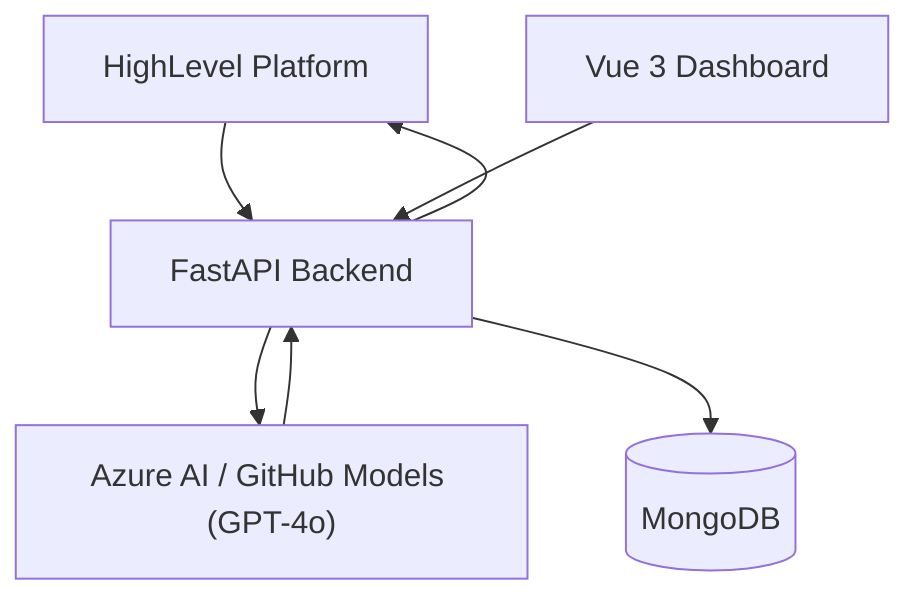

# Voice AI Observability Copilot

**Automated Monitoring & Optimization Platform (Validation Flywheel) for HighLevel (GHL) Voice AI Agents**

[](https://www.python.org/downloads/)
[](https://fastapi.tiangolo.com/)
[](https://beanie-odm.dev/)
[](https://docker.com)

---

## Table of Contents

1. [Overview](#1-overview)
2. [System Architecture](#2-system-architecture)
3. [Technology Stack](#3-technology-stack)
4. [Getting Started (Local)](#4-getting-started-local)
5. [Docker Setup](#5-docker-setup)
6. [CI/CD Pipelines](#6-cicd-pipelines)
7. [API Reference](#7-api-reference)
8. [Database Models](#8-database-models)
9. [LLM Auditing Pipeline](#9-llm-auditing-pipeline)
10. [Project Structure](#10-project-structure)
11. [Roadmap](#11-roadmap)

---

## 1. Overview

The **Voice AI Observability Copilot** is an automated monitoring and optimization platform—a **Validation Flywheel**—for [HighLevel (GHL)](https://www.gohighlevel.com/) Voice AI agents. The platform:

- **Ingests** post-call records and transcripts via webhooks
- **Analyzes** conversations using LLMs (GPT-4o) to extract core operational metrics
- **Detects** performance drift, script deviations, and compliance failures
- **Surfaces** actionable script modifications and "Use Actions" directly within an embedded HighLevel marketplace experience
- **Closes the loop** by providing prompt engineering recommendations that improve agent performance over time

**Stack:** Python / FastAPI backend → MongoDB (Beanie ODM) → Azure AI / GitHub Models (GPT-4o) → Vue 3 embedded dashboard.

### Core Flywheel

| Phase | Description |
|---|---|
| **Monitor** | `POST /api/webhook/voice-completed` ingests call transcripts from GHL |
| **Analyze** | LLM audits transcripts for deviations, hallucination detection, and opportunity recognition |
| **Optimize** | Recommends prompt optimizations and queues "Use Actions" for human review |

---

## 2. System Architecture



### Key Decisions

| Decision | Rationale |
|---|---|
| **FastAPI** | Async-native, auto OpenAPI docs, Pydantic validation |
| **MongoDB + Beanie** | Schema-flexible document store; async ODM |
| **Azure AI / GitHub Models** | Cost-effective GPT-4o with structured JSON output |
| **Server-rendered Vue 3** | Single endpoint serves dashboard via CDN, simple GHL iframe embedding |
| **Docker Compose** | One-command dev environment: MongoDB 7 + backend + ngrok |

---

## 3. Technology Stack

| Category | Technologies |
|---|---|
| **Backend** | Python 3.12+, FastAPI 0.138+, Uvicorn, Pydantic 2.13+, Beanie 2.1+, Motor 3.7+ |
| **LLM** | Azure AI Inference SDK (GitHub Models), GPT-4o |
| **Database** | MongoDB 7 (collections: `call_audit_logs`, `call_evaluations`, `use_actions`, `agent_profiles`) |
| **Frontend** | Vue 3 (CDN), Tailwind CSS (CDN), server-rendered via FastAPI |
| **Infrastructure** | Docker + Docker Compose, ngrok, Azure App Service, Azure Static Web Apps, GitHub Actions |

---

## 4. Getting Started (Local)

### Prerequisites
- Python 3.12+, MongoDB, GitHub PAT with Models access

### Setup
```bash
git clone https://github.com/ADARSHKUMAR2/Voice-AI-Observability-Copilot.git
cd Voice-AI-Observability-Copilot/backend
```

Create `backend/.env`:
```env
MONGO_URI=mongodb://localhost:27017/observability_copilot
GITHUB_TOKEN=ghp_your_github_token_here
PORT=5000
```

Install & run:
```bash
uv sync                          # or: pip install -r requirements.txt
python run.py                    # Starts at http://0.0.0.0:5000
```

Verify:
```bash
curl http://localhost:5000/health
# {"status": "healthy"}
```

### ngrok Tunnel (for GHL webhook testing)
```bash
brew install ngrok
ngrok config add-authtoken YOUR_AUTH_TOKEN
ngrok http 5000
```
Set GHL webhook URL to `https://<ngrok-url>.ngrok.io/api/webhook/voice-completed`.

---

## 5. Docker Setup

Run the entire stack with one command. Recommended for new contributors.

### Services

| Service | Image | Port | Purpose |
|---|---|---|---|
| **mongo** | `mongo:7` | `27017` | Database |
| **backend** | Custom build | `5001` | FastAPI app |
| **ngrok** | `ngrok/ngrok:latest` | Dynamic | Public HTTPS tunnel |

### Setup

Create `backend/.env`:
```env
PORT=5001
MONGO_URI=mongodb://mongo:27017/voice_copilot
GITHUB_TOKEN=ghp_your_github_token_here
```

Create root `.env`:
```env
NGROK_AUTHTOKEN=your_ngrok_authtoken_here
```

### Run
```bash
docker compose up --build -d
```

| Command | Purpose |
|---|---|
| `curl http://localhost:5001/health` | Verify backend |
| `docker compose logs -f backend` | View backend logs |
| `docker compose down` | Stop stack |
| `docker compose down -v` | Stop + delete DB data |

The ngrok tunnel uses a fixed subdomain: `https://january-laundry-devotion.ngrok-free.dev`. Configure GHL webhook to `https://january-laundry-devotion.ngrok-free.dev/api/webhook/voice-completed`.

### Dockerfile
```dockerfile
FROM python:3.12-slim
COPY --from=ghcr.io/astral-sh/uv:latest /uv /uvx /bin/
WORKDIR /app
COPY pyproject.toml uv.lock* ./
RUN uv sync --frozen --no-cache
COPY . .
EXPOSE 5001
CMD ["uv", "run", "uvicorn", "app.main:app", "--host", "0.0.0.0", "--port", "5001"]
```

---

## 6. CI/CD Pipelines

Two GitHub Actions workflows for Azure deployment:

| Workflow | Trigger | Jobs |
|---|---|---|
| `azure-deploy.yml` | Push/PR to `main` | Backend → Azure App Service + Frontend → Azure Static Web Apps |
| `azure-backend.yml` | Push to `Azure_CI_CD` | Backend → Azure App Service |

### Required Secrets

| Secret | Purpose |
|---|---|
| `AZURE_CREDENTIALS` | Azure service principal for `azure/login` |
| `AZURE_STATIC_WEB_APPS_API_TOKEN` | Static Web Apps deployment token |
| `ENV_GITHUB_TOKEN` | GitHub token for test phase LLM calls |

---

## 7. API Reference

| Endpoint | Method | Description |
|---|---|---|
| `/health` | GET | Health check → `{"status": "healthy"}` |
| `/api/webhook/voice-completed` | POST | Ingest GHL call transcript → triggers LLM audit |
| `/api/auth/verify` | POST | Verify `X-Copilot-Key` header → `{"status": "authenticated"}` |
| `/api/analytics/overview?locationId=<id>` | GET | Aggregate metrics (total calls, avg adherence, critical failures, pending reviews) |
| `/dashboard` | GET | Server-rendered Vue 3 dashboard for GHL iframe embedding |

### Webhook Request Body
```json
{
  "locationId": "string (optional)",
  "agentId": "string (optional)",
  "callId": "string (optional)",
  "transcript": "string (optional)"
}
```

### Analytics Response
```json
{
  "metrics": {
    "totalAuditedCalls": 42,
    "averageAdherence": 87.5,
    "criticalFailureCount": 3,
    "pendingHumanReviews": 5
  }
}
```

---

## 8. Database Models

### Collections

**`agent_profiles`** — Agent configurations & KPIs
| Field | Type | Notes |
|---|---|---|
| `locationId` | str (indexed) | GHL account location |
| `agentId` | str (unique) | Agent identifier |
| `agentName` | str | Human-readable name |
| `systemPrompt` | str | Agent system prompt |
| `kpis` | List[KPIItem] | Target KPIs (`name` + `description`) |

**`call_audit_logs`** — Simple audit logs (from `auditor.py`)
| Field | Type | Notes |
|---|---|---|
| `status` | str | `"Pass"` or `"Fail"` |
| `score` | int | Adherence score (0-100) |
| `deviations` | list[str] | Identified script deviations |
| `recommendation` | str | Prompt engineering recommendation |

**`call_evaluations`** — Rich scored evaluations (from `openai_auth.py`)
| Field | Type | Notes |
|---|---|---|
| `agentId` | str (indexed) | Agent identifier |
| `ghlCallId` | str (unique) | GHL call ID |
| `adherenceScore` | float (0-100) | Overall adherence |
| `hasCriticalFailure` | bool | Compliance failure detected |
| `kpiBreakdown` | List[KPICheck] | Per-KPI pass/fail/notes |

**`use_actions`** — Flagged segments for human review
| Field | Type | Notes |
|---|---|---|
| `callEvaluationId` | Link[CallEvaluation] | Parent evaluation reference |
| `flaggedSegment` | str | Flagged transcript text |
| `failureReason` | str | Why it was flagged |
| `status` | ActionStatus | `PENDING` / `RESOLVED` / `TRAINED` |

---

## 9. LLM Auditing Pipeline

Two audit services:

### Simple Auditor (`services/auditor.py`)
- **Input:** `VoiceTranscriptPayload` (flat, all optional fields)
- **Output:** `CallLogDocument` with `status`/`score`/`deviations`/`recommendation`
- **Used by:** Webhook endpoint
- **Flow:** Receives transcript → sends to GPT-4o → strips markdown fences → parses JSON → returns document

| Feature | Simple | Structured |
|---|---|---|
| KPI Breakdown | No (deviations only) | Yes, per-KPI with notes |
| Flagged Segments | No | Yes, with exact text |
| Schema Enforcement | Manual JSON parsing | Pydantic model validation |
| Best For | Quick pass/fail checks | In-depth compliance auditing |

---

## 10. Project Structure

```
voice-ai-observability-copilot/
├── docker-compose.yml               # MongoDB + Backend + ngrok
├── main.py                          # Root placeholder
├── README.md                        # This file
├── backend/
│   ├── Dockerfile                   # python:3.12-slim + uv
│   ├── run.py                       # Uvicorn entry point
│   ├── pyproject.toml / uv.lock     # Dependencies
│   ├── .env                         # Environment config
│   └── app/
│       ├── main.py                  # FastAPI app factory
│       ├── config/db.py             # MongoDB + Beanie init (+ Motor 3.7 compat shim)
│       ├── models/                  # AgentProfile, CallLogDocument, CallEvaluation, UseAction
│       ├── routers/                 # webhook.py, auth.py, dashboard.py, analytics.py
│       ├── middleware/auth.py       # Auth middleware (placeholder)
│       └── services/                # auditor.py, openai_auth.py, ghl.py (placeholder)
├── .github/workflows/
│   ├── azure-deploy.yml             # Main branch: backend + frontend deploy
│   └── azure-backend.yml            # Azure_CI_CD branch: backend-only deploy
└── frontend/
    └── index.html                   # Standalone Vue 3 dashboard
```

---

## Acknowledgments

- Built for [HighLevel](https://www.gohighlevel.com/) Voice AI platform
- LLM inference by [GitHub Models](https://github.com/marketplace/models) / [Azure AI](https://ai.azure.com/)
- Async ODM by [Beanie](https://beanie-odm.dev/) + [Motor](https://motor.readthedocs.io/)
- Container orchestration via [Docker Compose](https://docs.docker.com/compose/)
