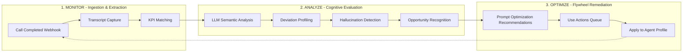
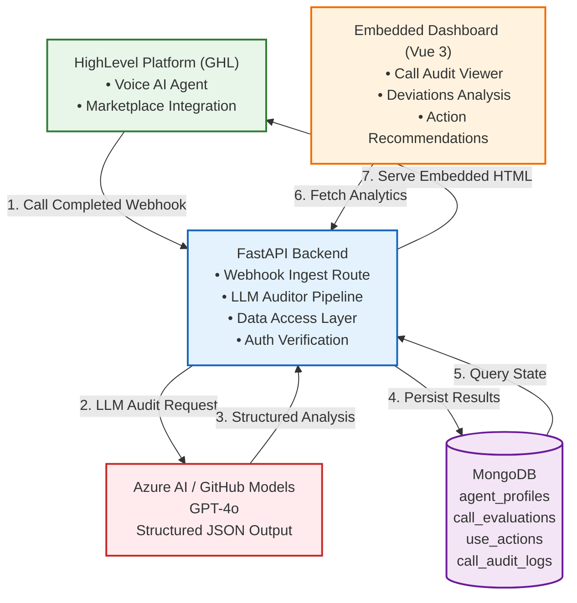

# Voice AI Observability Copilot

**Automated Monitoring & Optimization Platform (Validation Flywheel) for HighLevel (GHL) Voice AI Agents**

[](https://www.python.org/downloads/)
[](https://fastapi.tiangolo.com/)
[](https://beanie-odm.dev/)
[](LICENSE)

---

## Table of Contents

1. [Overview](#1-overview)
2. [Core Operational Flywheel](#2-core-operational-flywheel)
3. [System Architecture](#3-system-architecture)
4. [Project Structure](#4-project-structure)
5. [Technology Stack](#5-technology-stack)
6. [Getting Started](#6-getting-started)
7. [API Reference](#7-api-reference)
8. [Database Models](#8-database-models)
9. [LLM Auditing Pipeline](#9-llm-auditing-pipeline)
10. [HighLevel Marketplace Integration](#10-highlevel-marketplace-integration)
11. [File-by-File Deep Dive](#11-file-by-file-deep-dive)
12. [Roadmap](#12-roadmap)
13. [Contributing](#13-contributing)
14. [License](#14-license)

---

## 1. Overview

The **Voice AI Observability Copilot** is an automated monitoring and optimization platform—a **Validation Flywheel**—designed specifically for [HighLevel (GHL)](https://www.gohighlevel.com/) Voice AI agents. The platform:

- **Ingests** post-call records and transcripts via webhooks
- **Analyzes** conversations using Large Language Models (LLMs) to extract core operational metrics
- **Detects** performance drift, script deviations, and critical compliance failures
- **Surfaces** actionable script modifications and "Use Actions" directly within an embedded HighLevel marketplace experience
- **Closes the loop** by providing prompt engineering recommendations that improve agent performance over time

The backend is built entirely in **Python** using the **FastAPI** framework with **MongoDB** for persistence and **Azure AI / GitHub Models** for LLM inference (GPT-4o). The embedded dashboard is a **Vue 3** single-page application rendered server-side via FastAPI's HTML response.

---

## 2. Core Operational Flywheel

The system operates on a continuous three-phase feedback loop:



### Phase 1: Monitor (Ingestion & Extraction)
Asynchronous webhook processing captures voice transcripts and matches them against target Key Performance Indicators (KPIs). The `POST /api/webhook/voice-completed` endpoint receives call payloads from GHL and forwards them to the LLM auditing pipeline.

### Phase 2: Analyze (Cognitive Evaluation)
Semantic analysis profiles call segments, identifying conversational deviations, systemic agent hallucinations, or missed opportunities. Two audit pipelines exist:
- **Simple Auditor** (`auditor.py`): Returns a lightweight `status`/`score`/`deviations`/`recommendation` result.
- **Structured Auditor** (`openai_auth.py`): Returns a rich `AuditOutputSchema` with per-KPI breakdown, flagged segments, adherence scoring, and critical failure detection.

### Phase 3: Optimize (Flywheel Remediation)
Recommends system prompt optimizations and highlights specific edge cases requiring immediate human intervention, closing the loop back to monitoring. These recommendations are surfaced in the embedded dashboard and stored as `UseAction` documents for tracking.

---

## 3. System Architecture



### Key Architectural Decisions

| Decision | Rationale |
|---|---|
| **FastAPI** (Python) | Async-native Python framework with automatic OpenAPI docs, Pydantic validation, and excellent async performance |
| **MongoDB + Beanie ODM** | Schema-flexible document store ideal for variable call transcript structures; Beanie provides async ODM with built-in validation |
| **Azure AI / GitHub Models** | Cost-effective LLM inference via GitHub's free-tier model endpoint; supports GPT-4o with structured JSON output |
| **Server-rendered Vue 3 SPA** | Single endpoint serves the entire dashboard via Tailwind CSS + Vue 3 from CDN, keeping deployment simple for GHL iframe embedding |
| **Motor 3.7+ compatibility shim** | Beanie 2.1.0 relies on `append_metadata` method; Motor 3.7+ doesn't expose it, so we inject a compatibility wrapper in `db.py` |

---

## 4. Project Structure

```
voice-ai-observability-copilot/
├── README.md                        # Project documentation (this file)
├── architecture.md                  # Detailed architecture & design decisions
├── todo.md                          # Development roadmap & task tracking
├── main.py                          # Root entry placeholder
├── uv.lock                          # Root uv lockfile (project reference)
├── .python-version                  # Python 3.12
├── .gitignore                       # Ignores .env files and build artifacts
│
└── backend/
    ├── main.py                      # Backend entry placeholder
    ├── run.py                       # Uvicorn runner script (entry point)
    ├── requirements.txt             # Pinned dependencies (pip freeze)
    ├── pyproject.toml               # Python project metadata & uv dependencies
    ├── uv.lock                      # Backend uv lockfile
    ├── .env                         # Environment variables (MONGO_URI, GITHUB_TOKEN, etc.)
    ├── .python-version              # Backend Python version
    ├── README.md                    # Backend-specific README (placeholder)
    │
    └── app/
        ├── __init__.py              # Package init (empty)
        ├── main.py                  # FastAPI application factory & lifespan
        │
        ├── config/
        │   └── db.py                # MongoDB / Beanie ODM initialization
        │
        ├── models/
        │   ├── agent.py             # AgentProfile – agent configurations & KPIs
        │   ├── call_log.py          # CallLogDocument – simple audit log
        │   ├── evaluation.py        # CallEvaluation – scored evaluations
        │   └── action.py            # UseAction – flagged segments for humans
        │
        ├── routers/
        │   ├── webhook.py           # POST /api/webhook/voice-completed
        │   ├── auth.py              # POST /api/auth/verify
        │   ├── dashboard.py         # GET /dashboard (embedded Vue 3 UI)
        │   └── analytics.py         # GET /api/analytics/overview
        │
        ├── middleware/
        │   └── auth.py              # Auth middleware (placeholder, currently empty)
        │
        └── services/
            ├── auditor.py           # Simple LLM audit pipeline
            ├── openai_auth.py       # Structured AuditOutputSchema pipeline
            └── ghl.py               # GHL integration (placeholder, currently empty)
```

---

## 5. Technology Stack

### Backend
| Technology | Version | Purpose |
|---|---|---|
| **Python** | 3.12+ | Runtime language |
| **FastAPI** | 0.138+ | Async web framework |
| **Uvicorn** | 0.49+ | ASGI server |
| **Pydantic** | 2.13+ | Data validation & schema enforcement |
| **Beanie** | 2.1+ | Async MongoDB ODM (built on Motor) |
| **Motor** | 3.7+ | Async MongoDB driver |
| **PyMongo** | 4.17+ | Synchronous MongoDB driver (underlying Motor) |
| **Azure AI Inference** | 1.0.0b9 | GitHub Models / Azure AI LLM client |
| **python-dotenv** | 1.2+ | Environment variable loading |
| **httpx** | 0.28+ | HTTP client (transitive dependency) |

### Database
| Technology | Purpose |
|---|---|
| **MongoDB** | Document store for call logs, evaluations, actions, agent profiles |
| **Collections** | `call_audit_logs`, `call_evaluations`, `use_actions`, `agent_profiles` |

### LLM Inference
| Provider | Model | Endpoint |
|---|---|---|
| **GitHub Models** (via Azure AI) | `gpt-4o` | `https://models.inference.ai.azure.com` |

### Frontend (Embedded)
| Technology | Purpose |
|---|---|
| **Vue 3** (CDN) | Reactive UI framework |
| **Tailwind CSS** (CDN) | Utility-first styling |
| **Server-side rendering** | FastAPI returns raw HTML with inline Vue+Tailwind |

---

## 6. Getting Started

### Prerequisites

- **Python 3.12+**
- **MongoDB** (local or remote, e.g., MongoDB Atlas)
- **GitHub Personal Access Token** with Models access (for LLM inference)

### Installation

1. **Clone the repository**

   ```bash
   git clone https://github.com/ADARSHKUMAR2/Voice-AI-Observability-Copilot.git
   cd Voice-AI-Observability-Copilot/backend
   ```

2. **Set up environment variables**

   Create a `.env` file in `backend/`:

   ```env
   MONGO_URI=mongodb://localhost:27017/observability_copilot
   GITHUB_TOKEN=ghp_your_github_token_here
   PORT=5000
   ```

3. **Create a virtual environment & install dependencies**

   Using **uv** (recommended):
   ```bash
   uv sync
   ```

   Or using **pip**:
   ```bash
   python -m venv .venv
   source .venv/bin/activate
   pip install -r requirements.txt
   ```

4. **Start the server**

   ```bash
   python run.py
   ```

   The server starts at `http://0.0.0.0:5000` with auto-reload enabled.

5. **Verify health**

   ```bash
   curl http://localhost:5000/health
   # Response: {"status": "healthy"}
   ```

---

## 7. API Reference

### Health Check

```
GET /health
```

Returns a simple health-check response.

**Response:**
```json
{"status": "healthy"}
```

### Webhook Ingestion

```
POST /api/webhook/voice-completed
```

Receives a call-completed payload from HighLevel and triggers the LLM auditing pipeline.

**Request Body** (`VoiceTranscriptPayload`):
```json
{
  "locationId": "string (optional)",
  "agentId": "string (optional)",
  "callId": "string (optional)",
  "transcript": "string (optional)"
}
```

**Response (201 Created):**
```json
{
  "status": "processed",
  "record_id": "string (MongoDB ObjectId)"
}
```

### Authentication Verification

```
POST /api/auth/verify
```

Verifies an external application key via the `X-Copilot-Key` header.

**Headers:**
| Header | Type | Description |
|---|---|---|
| `X-Copilot-Key` | string | The API key for the copilot service |

**Response (200 OK):**
```json
{
  "status": "authenticated",
  "message": "App connection authorized."
}
```

**Response (401 Unauthorized):**
```json
{
  "detail": "Invalid authentication token provided."
}
```

### Analytics Overview

```
GET /api/analytics/overview?locationId=<location_id>
```

Returns aggregate analytics for a given GHL location.

**Query Parameters:**
| Parameter | Type | Required | Description |
|---|---|---|---|
| `locationId` | string | Yes | The GHL location ID |

**Response:**
```json
{
  "metrics": {
    "totalAuditedCalls": 42,
    "averageAdherence": 87.5,
    "criticalFailureCount": 3,
    "pendingHumanReviews": 5
  },
  "recentEvaluations": [...],
  "actionsQueue": [...]
}
```

### Embedded Dashboard

```
GET /dashboard
```

Serves the embedded Vue 3 dashboard as an HTML page for HighLevel iframe embedding. Fetches live call audit logs from MongoDB and renders them in a two-panel layout with a call list and detail view.

---

## 8. Database Models

### AgentProfile (`agent_profiles` collection)

Stores Voice AI agent configurations and their target KPIs.

| Field | Type | Description |
|---|---|---|
| `locationId` | `str` (indexed) | Maps back to the GHL account location |
| `agentId` | `str` (unique) | Unique identifier for the agent |
| `agentName` | `str` | Human-readable agent name |
| `systemPrompt` | `str` | The system prompt configuration for the agent |
| `kpis` | `List[KPIItem]` | Array of target KPIs (each with `name` and `description`) |

**KPIItem sub-schema:**
| Field | Type | Description |
|---|---|---|
| `name` | `str` | KPI name (e.g., "greeting_protocol") |
| `description` | `str` | Description of the expected behavior |

### CallLogDocument (`call_audit_logs` collection)

Stores simple audit log records from the lightweight auditor pipeline (`auditor.py`).

| Field | Type | Description |
|---|---|---|
| `locationId` | `Optional[str]` | GHL location ID |
| `agentId` | `Optional[str]` | Agent identifier |
| `callId` | `Optional[str]` | GHL call ID |
| `transcript` | `Optional[str]` | Full call transcript text |
| `status` | `str` | `"Pass"` or `"Fail"` |
| `score` | `int` | Adherence score (0-100) |
| `deviations` | `list[str]` | List of identified script deviations |
| `recommendation` | `str` | Prompt engineering recommendation |
| `createdAt` | `datetime` | UTC timestamp of creation |

### CallEvaluation (`call_evaluations` collection)

Stores rich, scored evaluations from the structured LLM audit pipeline (`openai_auth.py`).

| Field | Type | Description |
|---|---|---|
| `agentId` | `str` (indexed) | Agent identifier |
| `locationId` | `str` (indexed) | GHL location ID |
| `ghlCallId` | `str` (unique) | GHL call identifier |
| `transcript` | `str` | Full call transcript |
| `adherenceScore` | `float` (0-100) | Overall adherence percentage |
| `hasCriticalFailure` | `bool` | Whether a critical compliance failure was detected |
| `kpiBreakdown` | `List[KPICheck]` | Per-KPI pass/fail/notes breakdown |
| `recommendation` | `Optional[str]` | Optimization recommendation |
| `createdAt` | `datetime` | UTC timestamp of creation |

**KPICheck sub-schema:**
| Field | Type | Description |
|---|---|---|
| `kpiName` | `str` | The name of the KPI being checked |
| `passed` | `bool` | Whether the KPI was satisfied |
| `notes` | `str` | Auditor notes on the KPI evaluation |

### UseAction (`use_actions` collection)

Tracks flagged conversational segments requiring human intervention.

| Field | Type | Description |
|---|---|---|
| `callEvaluationId` | `Link[CallEvaluation]` | Reference to the parent evaluation |
| `locationId` | `str` (indexed) | GHL location ID |
| `flaggedSegment` | `str` | The exact transcript text that was flagged |
| `failureReason` | `str` | Description of why the segment was flagged |
| `status` | `ActionStatus` | One of `PENDING`, `RESOLVED`, `TRAINED` |
| `createdAt` | `datetime` | UTC timestamp of creation |

---

## 9. LLM Auditing Pipeline

The project provides **two audit service implementations**, each designed for different use cases.

### 9.1 Simple Auditor (`services/auditor.py`)

**Purpose:** Lightweight, real-time auditing that returns a simple pass/fail assessment.

**Endpoint:** Called by `POST /api/webhook/voice-completed`.

**LLM Instruction:** Instructs GPT-4o to analyze the transcript and return a minimal JSON blob:
```json
{
  "status": "Pass" or "Fail",
  "score": int,
  "deviations": ["string"],
  "recommendation": "string"
}
```

**Key Features:**
- Strips markdown code block wrapping from LLM output (defensive parsing)
- Returns a `CallLogDocument` ready for direct insertion into MongoDB
- Simple `VoiceTranscriptPayload` input model with all optional fields for debug flexibility

**Flow:**
1. Receives `VoiceTranscriptPayload` from webhook
2. Sends transcript to GPT-4o via Azure AI ChatCompletionsClient
3. Parses the JSON response (with markdown fence stripping)
4. Returns a `CallLogDocument` with status, score, deviations, recommendation

### 9.2 Structured Auditor (`services/openai_auth.py`)

**Purpose:** Rich, schema-enforced auditing with per-KPI breakdowns, flagged segment extraction, and adherence scoring.

**Output Schema (`AuditOutputSchema`):**

| Field | Type | Description |
|---|---|---|
| `adherenceScore` | `float` | Overall adherence percentage (0-100) |
| `hasCriticalFailure` | `bool` | Whether a critical compliance failure was detected |
| `kpiBreakdown` | `List[KPIMatch]` | Per-KPI pass/fail assessment with notes |
| `recommendation` | `str` | Optimization recommendation text |
| `flaggedSegments` | `Optional[List[FlaggedSegment]]` | Specific transcript segments that failed |

**KPIMatch sub-schema:**
| Field | Type | Description |
|---|---|---|
| `kpiName` | `str` | Name of the evaluated KPI |
| `passed` | `bool` | Whether the KPI was satisfied |
| `notes` | `str` | Auditor notes |

**FlaggedSegment sub-schema:**
| Field | Type | Description |
|---|---|---|
| `segmentText` | `str` | The exact flagged transcript text |
| `reasonForFailure` | `str` | Reason the segment was flagged |

**Key Features:**
- Pydantic `model_json_schema()` dynamically generates the expected JSON schema, preventing schema drift
- Receives the system prompt and KPI definitions as additional context for the LLM
- Strict structured output enforced through the system instruction prompt
- Temperature set to 0.2 for consistent, deterministic results

**Flow:**
1. Accepts `transcript`, `system_prompt`, and `kpis` (list of `KPIItem`)
2. Dynamically generates the JSON schema from `AuditOutputSchema.model_json_schema()`
3. Sends comprehensive context (system prompt + KPIs + transcript) to GPT-4o
4. Parses and validates the LLM response directly into an `AuditOutputSchema` instance via `model_validate_json()`

### Auditor Comparison

| Feature | Simple Auditor | Structured Auditor |
|---|---|---|
| Input Model | `VoiceTranscriptPayload` (flat) | `transcript` + `system_prompt` + `kpis` |
| Output Model | `CallLogDocument` | `AuditOutputSchema` |
| KPI Breakdown | No (deviations only) | Yes, per-KPI pass/fail with notes |
| Flagged Segments | No | Yes, with exact text and failure reason |
| Schema Enforcement | JSON parsing with manual keys | Pydantic model validation |
| Best For | Quick pass/fail checks | In-depth compliance auditing |

---

## 10. HighLevel Marketplace Integration

The platform is designed to integrate with HighLevel's marketplace architecture:

1. **Authentication:** The `POST /api/auth/verify` endpoint validates the `X-Copilot-Key` header, supporting GHL's app authorization flow. Location context (`locationId`) is passed via webhook payloads.

2. **Ingestion:** The `POST /api/webhook/voice-completed` endpoint listens for GHL's standard `call_status = completed` webhook notifications with transcript data.

3. **UI Delivery:** The `GET /dashboard` endpoint serves a server-rendered Vue 3 application designed for iframe embedding via GHL's Custom Menu Link system. The dashboard features:
   - A left panel listing all monitored calls with pass/fail status badges
   - A right panel showing transcript details, deviations, and prompt engineering recommendations
   - Real-time status indicators (pulsing green dot for active integration)

4. **Analytics:** The `GET /api/analytics/overview` endpoint provides aggregate metrics for a given location, including total audited calls, average adherence scores, critical failure counts, and pending human reviews.

---

## 11. File-by-File Deep Dive

This section provides a detailed explanation of every source file in the project, describing its purpose, key components, and how it fits into the overall architecture.

---

### Root Level Files

#### `main.py` (root)
**Purpose:** Root-level entry placeholder for the project.

This is a minimal script that prints `"Hello from voice-ai-observability-copilot!"` when executed. It serves as a package-level marker and can be used for quick testing of the Python environment. It's not part of the backend server itself.

```python
def main():
    print("Hello from voice-ai-observability-copilot!")

if __name__ == "__main__":
    main()
```

#### `architecture.md`
**Purpose:** Detailed architecture document providing a high-level overview of the system design, component interactions, and database schemas.

This file contains:
- A system overview describing the Validation Flywheel concept
- Three core operational pillars: Monitor, Analyze, Optimize
- An architecture diagram (Mermaid flowchart) showing GHL, Node.js API Express (original design), Vue.js frontend, and database layers
- Component deep dives for the HighLevel integration layer, backend services, and frontend client
- Structured relational database schema examples (agent_profiles, call_evaluations, use_actions)
- Security and operational guards including request verification, context integrity, and graceful failure handling

> **Note:** The `architecture.md` describes the **original design intent** (Node.js Express + Vue.js), while the actual implementation uses **Python FastAPI + server-rendered Vue 3**. The document serves as a design reference and should be updated to reflect the current Python implementation.

#### `todo.md`
**Purpose:** Development roadmap and task tracking document organized into four phases:

- **Phase 1:** Environment setup and infrastructure foundations (Git init, GHL account, backend scaffold, frontend scaffold, env files)
- **Phase 2:** Ingestion and backend core pipeline (webhook route, database schemas, LLM evaluation client, tests, signature validation)
- **Phase 3:** Analytics dashboard and UI construction (Vue routing, executive analytics, Use Actions component, Prompt Strategy Sandbox, state management)
- **Phase 4:** Marketplace integration and loop optimization (prompt patch triggers, deployment, GHL Custom Menu Link registration, end-to-end dry runs)

#### `uv.lock`
**Purpose:** Root-level lockfile for the `uv` package manager, ensuring reproducible dependency installations. This is generated by `uv lock` and should be committed to version control.

#### `.python-version` (root)
**Purpose:** Specifies the Python version for the project using `pyenv` or similar tools. Content: `3.12`

#### `.gitignore`
**Purpose:** Standard Python `.gitignore` that excludes `.env` files, `__pycache__/`, virtual environment directories, build artifacts, and IDE-specific files from version control.

---

### Backend Root Files

#### `backend/main.py`
**Purpose:** Backend entry placeholder. A simple script that could serve as an alternative entry point for the backend package. Currently identical in structure to the root `main.py`.

#### `backend/run.py`
**Purpose:** The primary entry point for starting the backend server.

This script:
1. Loads environment variables from `.env` using `python-dotenv`
2. Reads the `PORT` environment variable (defaults to `5000`)
3. Starts Uvicorn with the FastAPI app from `app.main:app` on `0.0.0.0` with hot-reload enabled

```python
import uvicorn
import os
from dotenv import load_dotenv

load_dotenv()

if __name__ == "__main__":
    port = int(os.getenv("PORT", 5000))
    uvicorn.run("app.main:app", host="0.0.0.0", port=port, reload=True)
```

#### `backend/pyproject.toml`
**Purpose:** Python project metadata and dependency declaration for the `uv` package manager.

Declares:
- Project name: `backend`, version `0.1.0`
- Python requirement: `>=3.12`
- Dependencies including FastAPI, Beanie, Motor, Azure AI Inference, Pydantic, Uvicorn, python-dotenv, cryptography, aiohttp, and OpenAI

This is the authoritative dependency file when using `uv sync`. The `requirements.txt` is a freeze of resolved versions for `pip` users.

#### `backend/requirements.txt`
**Purpose:** Pinned dependency snapshot generated by `pip freeze` for reproducible installations.

Contains 30 packages with exact version numbers, including all transitive dependencies such as:
- `starlette==1.3.1` (underlying FastAPI web toolkit)
- `pydantic-core==2.46.4` (Pydantic's Rust-based core validation engine)
- `pymongo==4.17.0` (synchronous MongoDB driver, underlying Motor)
- `httpx==0.28.1`, `httpcore==1.0.9`, `h11==0.16.0` (HTTP client and server tooling)
- `typing-extensions==4.15.0`, `typing-inspection==0.4.2` (type hint utilities)
- `tqdm==4.68.3` (progress bars, transitive from beanie)
- `dnspython==2.8.0` (DNS resolver, for MongoDB SRV URI connections)
- `certifi==2026.6.17`, `cffi==2.0.0`, `pycparser==3.0` (certificate validation and CFFI bindings)
- `sniffio==1.3.1` (async library detection)
- `anyio==4.14.1` (low-level async runtime)
- `distro==1.9.0` (OS identification)
- `idna==3.18` (internationalized domain names)
- `jiter==0.15.0` (JSON parsing, transitive dependency)
- `lazy-model==0.4.0` (lazy loading for Beanie ODM)
- `annotated-types==0.7.0` (Pydantic annotated type support)

#### `backend/.env`
**Purpose:** Environment configuration file (excluded from version control by `.gitignore`).

Contains sensitive configuration values:
- `MONGO_URI`: MongoDB connection string
- `GITHUB_TOKEN`: GitHub Personal Access Token for LLM inference
- `PORT`: Server port (default 5000)

#### `backend/README.md`
**Purpose:** Placeholder README for the backend package. Currently minimal but intended for backend-specific documentation.

---

### Application Core (`backend/app/`)

#### `backend/app/__init__.py`
**Purpose:** Package initialization marker. An empty file that tells Python to treat the `app` directory as a package, enabling imports like `from app.config.db import init_db`.

#### `backend/app/main.py`
**Purpose:** FastAPI application factory and server lifecycle manager.

This is the central application file. Here's what it does:

**Lifespan Management:**
```python
@asynccontextmanager
async def lifespan(app: FastAPI):
    mongo_uri = os.getenv("MONGO_URI", "mongodb://localhost:27017/voice_copilot")
    client = AsyncIOMotorClient(mongo_uri)
    await init_beanie(database=client.get_default_database(), document_models=[CallLogDocument])
    yield
```
The `lifespan` async context manager handles startup and shutdown. On startup, it:
- Creates an `AsyncIOMotorClient` using the MONGO_URI from env vars (with a fallback to `localhost:27017/voice_copilot`)
- Initializes Beanie ODM with the `CallLogDocument` model (note: the `init_db()` function in `config/db.py` initializes the other models separately)

**Startup Event:**
```python
@app.on_event("startup")
async def startup_event():
    await init_db()
```
There's a **dual initialization** pattern: the `lifespan` initializes `CallLogDocument` via Motor directly, while the `startup_event` calls `init_db()` which initializes `AgentProfile`, `CallEvaluation`, and `UseAction` via Beanie. This ensures all document models are registered.

**Router Registration:**
- `dashboard.router` → mounted at root (`/dashboard`)
- `auth.router` → mounted at `/api/auth` with "Authentication" tag
- `webhook.router` → mounted at `/api/webhook` with "Ingestion" tag

**CORS Middleware:**
```python
app.add_middleware(
    CORSMiddleware,
    allow_origins=["*"],
    allow_credentials=True,
    allow_methods=["*"],
    allow_headers=["*"],
)
```
Wide-open CORS policy for development; should be restricted in production to specific GHL origins.

**Health Endpoint:**
```python
@app.get("/health", response_model=HealthResponse)
def health_check() -> HealthResponse:
    return HealthResponse(status="healthy")
```
A simple synchronous health check returning `{"status": "healthy"}`.

---

### Configuration (`backend/app/config/`)

#### `backend/app/config/db.py`
**Purpose:** MongoDB / Beanie ODM initialization with a critical Motor 3.7+ compatibility shim.

**Motor 3.7+ Compatibility Shim:**
```python
def _motor_append_metadata(
    self: AsyncIOMotorClient, driver_info: DriverInfo
) -> None:
    self.delegate.append_metadata(driver_info)

AsyncIOMotorClient.append_metadata = _motor_append_metadata
```
This is a **critical workaround** for a breaking change in Motor 3.7+. In Motor 3.7+, `AsyncIOMotorClient` no longer passes through `append_metadata` to the underlying PyMongo `MongoClient`. Since Beanie 2.1.0 calls `client.append_metadata()` during `init_beanie`, this would silently create a database reference named `"append_metadata"` instead. The shim explicitly attaches the method to bypass `__getattr__`.

**`init_db()` Function:**
```python
async def init_db():
    mongo_uri = os.getenv("MONGO_URI", "mongodb://localhost:27017/observability_copilot")
    client = AsyncIOMotorClient(mongo_uri)
    database = client.get_default_database()
    await init_beanie(
        database=database,
        document_models=[
            AgentProfile,
            CallEvaluation,
            UseAction
        ]
    )
    print("🚀 Asynchronous Beanie ODM pipeline database online.")
```
Initializes Beanie with the three primary document models. Note the default database name is `observability_copilot` (different from the `voice_copilot` fallback in `main.py`).

---

### Data Models (`backend/app/models/`)

#### `backend/app/models/agent.py`
**Purpose:** Defines the `AgentProfile` document model and the `KPIItem` sub-schema.

**KPIItem:**
```python
class KPIItem(BaseModel):
    name: str
    description: str
```
A simple Pydantic model representing a single KPI definition. Each KPI has a `name` (e.g., "greeting_protocol") and a `description` explaining the expected behavior.

**AgentProfile:**
```python
class AgentProfile(Document):
    locationId: str = Field(..., index=True)
    agentId: str = Field(..., unique=True)
    agentName: str
    systemPrompt: str
    kpis: List[KPIItem] = []

    class Settings:
        name = "agent_profiles"
```
A Beanie `Document` mapped to the `agent_profiles` collection. Key design decisions:
- `locationId` is indexed for efficient location-scoped queries
- `agentId` is unique, ensuring each agent has exactly one profile
- `systemPrompt` stores the complete agent system prompt for LLM auditing context
- `kpis` is a list of `KPIItem` objects defining target behavioral criteria

#### `backend/app/models/call_log.py`
**Purpose:** Defines the `VoiceTranscriptPayload` (webhook input) and `CallLogDocument` (audit log output).

**VoiceTranscriptPayload:**
```python
class VoiceTranscriptPayload(BaseModel):
    locationId: Optional[str] = None
    agentId: Optional[str] = None
    callId: Optional[str] = None
    transcript: Optional[str] = None
```
This is the **webhook input schema** used by `POST /api/webhook/voice-completed`. All fields are `Optional` with `None` defaults for debugging flexibility—this allows testing with partial payloads during development. In production, consider making required fields mandatory.

**CallLogDocument:**
```python
class CallLogDocument(Document):
    locationId: Optional[str] = None
    agentId: Optional[str] = None
    callId: Optional[str] = None
    transcript: Optional[str] = None
    status: str
    score: int
    deviations: list[str]
    recommendation: str
    createdAt: datetime = datetime.utcnow()

    class Settings:
        name = "call_audit_logs"
```
A Beanie `Document` mapped to the `call_audit_logs` collection. This is the output model from the simple auditor pipeline (`auditor.py`). Note: `createdAt` uses `datetime.utcnow()` as a default, but this is evaluated at function definition time in practice (uses the time when the class is first loaded). In production, consider using a `default_factory` to evaluate at call time.

#### `backend/app/models/evaluation.py`
**Purpose:** Defines the `KPICheck` sub-schema and `CallEvaluation` document for the structured audit pipeline.

**KPICheck:**
```python
class KPICheck(BaseModel):
    kpiName: str
    passed: bool
    notes: str
```
Represents the evaluation result for a single KPI, with whether it passed and any auditor notes.

**CallEvaluation:**
```python
class CallEvaluation(Document):
    agentId: str = Field(..., index=True)
    locationId: str = Field(..., index=True)
    ghlCallId: str = Field(..., unique=True)
    transcript: str
    adherenceScore: float = Field(..., ge=0, le=100)
    hasCriticalFailure: bool = False
    kpiBreakdown: List[KPICheck] = []
    recommendation: Optional[str] = None
    createdAt: datetime = Field(default_factory=datetime.utcnow)

    class Settings:
        name = "call_evaluations"
```
A Beanie `Document` mapped to the `call_evaluations` collection. Key design:
- `agentId` and `locationId` are indexed for efficient queries
- `ghlCallId` is unique to prevent duplicate evaluations
- `adherenceScore` is constrained to 0-100 with Pydantic validation (`ge=0, le=100`)
- `kpiBreakdown` stores per-KPI evaluation results
- `createdAt` uses `default_factory` (properly evaluated at call time)

#### `backend/app/models/action.py`
**Purpose:** Defines the `ActionStatus` enum and `UseAction` document for tracking flagged segments.

**ActionStatus:**
```python
class ActionStatus(str, Enum):
    PENDING = "PENDING"
    RESOLVED = "RESOLVED"
    TRAINED = "TRAINED"
```
A string enum representing the lifecycle of a flagged action: `PENDING` (awaiting review), `RESOLVED` (issue addressed), `TRAINED` (agent re-trained on this case).

**UseAction:**
```python
class UseAction(Document):
    callEvaluationId: Link[CallEvaluation]
    locationId: str = Field(..., index=True)
    flaggedSegment: str
    failureReason: str
    status: ActionStatus = ActionStatus.PENDING
    createdAt: datetime = Field(default_factory=datetime.utcnow)

    class Settings:
        name = "use_actions"
```
A Beanie `Document` mapped to the `use_actions` collection. Key design:
- `callEvaluationId` is a `Link[CallEvaluation]` (Beanie's relationship mechanism) pointing back to the parent evaluation
- `locationId` is indexed for location-scoped queries
- `status` defaults to `PENDING` when a new action is created

---

### Routers (`backend/app/routers/`)

#### `backend/app/routers/webhook.py`
**Purpose:** Webhook ingestion endpoint for receiving call-completed events from HighLevel.

```python
@router.post("/voice-completed", status_code=status.HTTP_201_CREATED)
async def handle_incoming_ghl_transcript(payload: VoiceTranscriptPayload):
    print("\n🚨 DEBUG: INBOUND PAYLOAD RECEIVED FROM GHL:")
    print(payload.model_dump())
    print("🚨 END DEBUG\n")
    
    audit_record = await audit_voice_transcript(payload)
    await audit_record.insert()
    return {"status": "processed", "record_id": str(audit_record.id)}
```

**Flow:**
1. Receives a POST request with a `VoiceTranscriptPayload` JSON body
2. Logs the full payload for debugging
3. Calls `audit_voice_transcript()` from `services/auditor.py` to perform LLM analysis
4. Inserts the resulting `CallLogDocument` into MongoDB
5. Returns a 201 response with the record ID

#### `backend/app/routers/auth.py`
**Purpose:** Authentication verification endpoint for HighLevel marketplace app authorization.

```python
MOCK_VALID_API_KEY = "copilot_secret_test_key_123"

@router.post("/verify")
async def verify_external_user(x_copilot_key: str = Header(None, alias="X-Copilot-Key")):
    if not x_copilot_key:
        raise HTTPException(status_code=400, detail="Missing secure identification header.")
    
    if x_copilot_key == MOCK_VALID_API_KEY:
        return {"status": "authenticated", "message": "App connection authorized."}
    
    raise HTTPException(status_code=401, detail="Invalid authentication token provided.")
```

**Flow:**
1. Reads the `X-Copilot-Key` header from the request
2. Validates it against a mock API key (`copilot_secret_test_key_123`)
3. Returns 200 with authentication success or 401 with failure
4. Returns 400 if the header is missing entirely

> **Note:** The API key is hardcoded for development. In production, validate against a database of authorized keys or use OAuth 2.0.

#### `backend/app/routers/dashboard.py`
**Purpose:** Serves the embedded Vue 3 analytics dashboard as a server-rendered HTML page.

**Flow:**
1. Fetches all `CallLogDocument` records from MongoDB
2. Serializes them into JSON
3. Injects the JSON into a Vue 3 application template
4. Returns the complete HTML page

**Vue 3 Dashboard Features:**
- **Left Panel (Call List):** Lists all monitored calls with their IDs, agent IDs, and pass/fail status badges. Clicking a call selects it for detail view. Styled with a dark theme matching the GHL design language.
- **Right Panel (Detail View):** Shows when a call is selected:
  - Core Performance Grader with score display
  - Critical failure warning banner (red) when status is "Fail"
  - Raw call transcript display
  - Identified deviations and failures list
  - Immediate prompt engineering action items
- **Empty State:** "Select an inbound call trace stream file to inspect compliance scores" when no call is selected
- **Auto-select:** Automatically selects the first call in the list on mount

The dashboard uses Tailwind CSS for styling (loaded from CDN) and Vue 3's Composition API (loaded from unpkg).

#### `backend/app/routers/analytics.py`
**Purpose:** Analytics overview endpoint providing aggregate metrics for a GHL location.

```python
@router.get("/overview")
async def get_location_overview(locationId: str = Query(...)):
```

**Flow:**
1. Fetches the 50 most recent `CallEvaluation` records for the given `locationId`
2. Fetches all `PENDING` `UseAction` records for the location
3. Calculates aggregate metrics:
   - `totalAuditedCalls`: Count of evaluations
   - `averageAdherence`: Mean adherence score across evaluations
   - `criticalFailureCount`: Count of evaluations with critical failures
   - `pendingHumanReviews`: Count of pending actions
4. Returns metrics, recent evaluations, and the actions queue

---

### Services (`backend/app/services/`)

#### `backend/app/services/auditor.py`
**Purpose:** Lightweight LLM audit pipeline that analyzes voice transcripts and returns a simple pass/fail assessment.

**Complete Flow:**

1. **Load environment:** Loads `GITHUB_TOKEN` from `.env`
2. **Create LLM client:** Initializes an async `ChatCompletionsClient` pointing to `https://models.inference.ai.azure.com` with the GitHub token
3. **Prepare system instruction:** Instructs GPT-4o to analyze the transcript for script deviations, broken instructions, and missed opportunities. The LLM is told to return a strict JSON schema:
   ```json
   {"status": "Pass" or "Fail", "score": int, "deviations": ["string"], "recommendation": "string"}
   ```
4. **Send request:** Sends the system instruction and transcript to GPT-4o with `temperature=0.2` for consistent results
5. **Defensive parsing:** Strips any markdown code block wrapping (` ```json ... ``` `) from the LLM response to handle cases where the LLM wraps JSON in markdown fences
6. **Parse JSON:** Safely parses the sanitized string into a Python dictionary
7. **Close client:** Ensures the async HTTP client session is properly closed
8. **Return model:** Constructs and returns a `CallLogDocument` with the parsed analysis

**Key Design Patterns:**
- **Defensive guard** for markdown fence stripping (lines 41-47)
- **Graceful fallback** with default values in the `CallLogDocument` constructor (e.g., `analysis.get("status", "Fail")`)

#### `backend/app/services/openai_auth.py`
**Purpose:** Structured LLM audit pipeline that returns a rich `AuditOutputSchema` with per-KPI breakdowns and flagged segments.

**Complete Flow:**

1. **Load environment:** Loads `GITHUB_TOKEN` from `.env`
2. **Create LLM client:** Initializes async `ChatCompletionsClient` pointing to Azure AI endpoint
3. **Format KPIs:** Converts the incoming `kpis` list (expected as `KPIItem` objects) into a serializable format with `name` and `description`
4. **Generate schema:** Dynamically generates the expected JSON schema from `AuditOutputSchema.model_json_schema()`, ensuring the LLM's output structure always matches the Pydantic model
5. **Prepare system instruction:** Instructs GPT-4o to:
   - Act as an enterprise AI Voice Agent Auditor
   - Analyze transcript context against prompt constraints and targeted KPIs
   - Output a single valid JSON object matching the provided schema
6. **Send request:** Sends the system instruction and user message containing:
   - The original Voice Agent system prompt
   - The target KPIs (JSON formatted)
   - The call transcript
7. **Parse response:** Extracts the raw JSON string from the LLM response
8. **Close client:** Ensures proper cleanup of the async client
9. **Validate:** Uses Pydantic's `model_validate_json()` to parse and validate the raw JSON directly into an `AuditOutputSchema` instance

**Key Design Patterns:**
- **Schema dynamic generation:** `AuditOutputSchema.model_json_schema()` prevents schema drift between the code and the LLM prompt
- **Pydantic validation:** `model_validate_json()` ensures the LLM output conforms exactly to the expected schema
- **Separation of concerns:** This service is designed to be used separately from the webhook router (it's not called by the current webhook endpoint, which uses `auditor.py`)

#### `backend/app/services/ghl.py`
**Purpose:** HighLevel integration service (placeholder).

This file is currently empty. It's intended to contain GHL-specific API client code for:
- OAuth 2.0 token management
- Agent profile CRUD operations via GHL API
- Prompt update push to agent configurations
- Marketplace event handling

---

### Middleware (`backend/app/middleware/`)

#### `backend/app/middleware/auth.py`
**Purpose:** Authentication middleware (placeholder).

This file is currently empty. It's intended to contain FastAPI middleware for:
- Global request authentication
- JWT token validation
- GHL webhook signature verification
- Rate limiting or IP whitelisting

---

## 12. Roadmap

### Phase 1: Environment Setup & Infrastructure Foundations
- [x] Initialize Git repository matching architectural guidelines (`/backend`)
- [ ] Set up HighLevel Developer Marketplace account and configure a Sandbox sub-account
- [ ] Scaffold frontend application (when frontend is separated from backend)
- [ ] Establish environment files (`.env.example`) covering API keys, database URLs, and port bindings

### Phase 2: Ingestion & Backend Core Pipeline (Monitor)
- [x] Design `/api/webhook/voice-completed` processing route
- [x] Connect database layer schemas (`agent_profiles`, `call_evaluations`, `use_actions`, `call_audit_logs`)
- [x] Build LLM evaluation client using structured outputs (simple + structured auditors)
- [ ] Write integration unit tests mapping mock transcripts onto the analysis engine
- [ ] Implement signature validation handling on webhook requests to protect system endpoints
- [ ] Migrate from mock API key to database-backed authentication

### Phase 3: Analytics Dashboard & UI Construction (Analyze)
- [x] Build embedded dashboard with Vue 3 + Tailwind CSS
- [x] Implement call audit viewer with deviation analysis
- [ ] Create the **"Use Actions"** component rendering pinpointed call fragments alongside contextual failure flags
- [ ] Construct the **Prompt Strategy Sandbox** component displaying current vs. optimized system prompts
- [ ] Add state management routines for seamless asynchronous polling or update dispatching

### Phase 4: Marketplace Integration & Loop Optimization (Flywheel)
- [ ] Set up interactive triggers linking prompt patches back to agent profile configurations
- [ ] Deploy backend to production-scalable environments (e.g., Render, AWS, Railway)
- [ ] Register custom iframe applications or Custom Menu Links in the GHL Developer portal
- [ ] Conduct end-to-end operational dry-runs within the live HighLevel Sandbox account interface
- [ ] Implement GHL OAuth 2.0 flow for marketplace authentication
- [ ] Implement GHL API integration for pushing prompt updates to agents

---

## 13. Contributing

1. Fork the repository
2. Create a feature branch (`git checkout -b feature/amazing-feature`)
3. Commit your changes (`git commit -m 'Add some amazing feature'`)
4. Push to the branch (`git push origin feature/amazing-feature`)
5. Open a Pull Request

Please ensure your code follows the existing patterns:
- Use async/await for all I/O operations
- Add Pydantic models for request/response schemas
- Document all API endpoints with descriptive docstrings
- Handle errors gracefully with appropriate HTTP status codes
- Test with mock transcripts before submitting

---

## 14. License

Distributed under the MIT License. See `LICENSE` for more information.

---

## Acknowledgments

- Built for the [HighLevel](https://www.gohighlevel.com/) Voice AI platform
- LLM inference powered by [GitHub Models](https://github.com/marketplace/models) / [Azure AI](https://ai.azure.com/)
- Async ODM powered by [Beanie](https://beanie-odm.dev/) and [Motor](https://motor.readthedocs.io/)