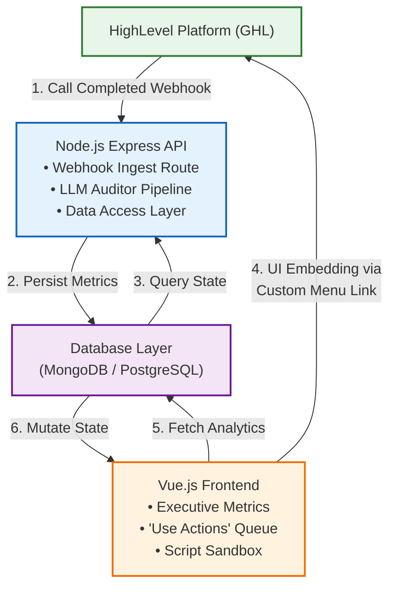

# Architecture Document: Agent Observability Copilot

## 1. System Overview
The **Agent Observability Copilot** is an automated monitoring and optimization platform ("Validation Flywheel") designed specifically for HighLevel (GHL) Voice AI agents. The system ingests post-call records and transcripts, extracts core operational metrics using Large Language Models (LLMs), detects performance drift or critical compliance failures, and surfaces actionable script modifications and "Use Actions" directly within an embedded HighLevel marketplace experience.

---

## 2. Core Operational Pillars
The system operates on a continuous feedback loop:
1. **Monitor (Ingestion & Extraction):** Asynchronous webhook processing captures voice transcripts and matches them against target Key Performance Indicators (KPIs).
2. **Analyze (Cognitive Evaluation):** Semantic analysis profiles call segments, identifying conversational deviations, systemic agent hallucinations, or missed opportunities.
3. **Optimize (Flywheel Remediation):** Recommends system prompt optimizations and highlights specific edge cases requiring immediate human intervention.

---

## 3. High-Level System Architecture

## 4. Component Deep Dive

### 4.1. HighLevel Integration Layer
* **Authentication:** OAuth 2.0 flow integrated into GHL's marketplace architecture. Location context (`location_id`) is grabbed safely via iframe query parameters.
* **Ingestion:** Listens to standard GHL webhook notification structures (`call_status = completed`).
* **UI Delivery:** Rendered natively via GHL's Custom Menu Link system utilizing an authenticated, responsive `iframe`.

### 4.2. Backend Services Node.js Layer
* **Framework:** Express with asynchronous middleware processing.
* **Audit Engine:** Evaluates structured data structures via LLMs (e.g., `gpt-4o`, `claude-3-5-sonnet`) with enforced JSON structural schemas.
* **Persistence Matrix:** Stores raw event payloads, token consumption telemetry, evaluated KPI schemas, and actionable text annotations.

### 4.3. Frontend Client Vue.js Layer
* **Engine:** Vue 3 framework using declarative composition principles.
* **Layout Design:** Styled to match the GHL design language ecosystem.
* **Key Modules:**
  * **Executive Metrics Dashboard:** Visualizes adherence rates, aggregate call metrics, and systemic drift over time.
  * **"Use Actions" Workflow:** High-fidelity list pinpointing exact call offsets and structural transcripts flagged for immediate manual human intervention.
  * **Prompt Strategy Sandbox:** Compares suggested system prompt adjustments against original agent prompts, letting developers click-to-apply updates.

---

## 5. Structured Database Schema (Relational Example)

### Table: `agent_profiles`
* `id` (UUID, PK)
* `location_id` (String) - Maps back directly to GHL Account
* `agent_name` (String)
* `system_prompt` (Text)
* `kpi_criteria` (JSONB) - Expected behavioral configurations

### Table: `call_evaluations`
* `id` (UUID, PK)
* `agent_id` (UUID, FK -> `agent_profiles.id`)
* `ghl_call_id` (String, Indexed)
* `transcript` (Text)
* `adherence_score` (Numeric, 0-100)
* `has_critical_failure` (Boolean)
* `kpi_breakdown` (JSONB) - Status flags per KPI target
* `actionable_recommendations` (Text)
* `created_at` (Timestamp)

### Table: `use_actions`
* `id` (UUID, PK)
* `call_id` (UUID, FK -> `call_evaluations.id`)
* `flagged_segment` (Text)
* `failure_reason` (String)
* `status` (Enum: `PENDING`, `RESOLVED`, `TRAINED`)

---

## 6. System Security & Operational Guards
1. **Request Verification:** Validates standard GHL signature headers on webhook endpoints to prevent data spoofing.
2. **Context Integrity:** Sanitizes input strings passing through the LLM auditing pipeline to mitigate prompt-injection vectors.
3. **Graceful Failures:** Implements circuit-breakers around external LLM calls; network lag or service errors fall back gracefully to retry queues without dropping call webhooks.
